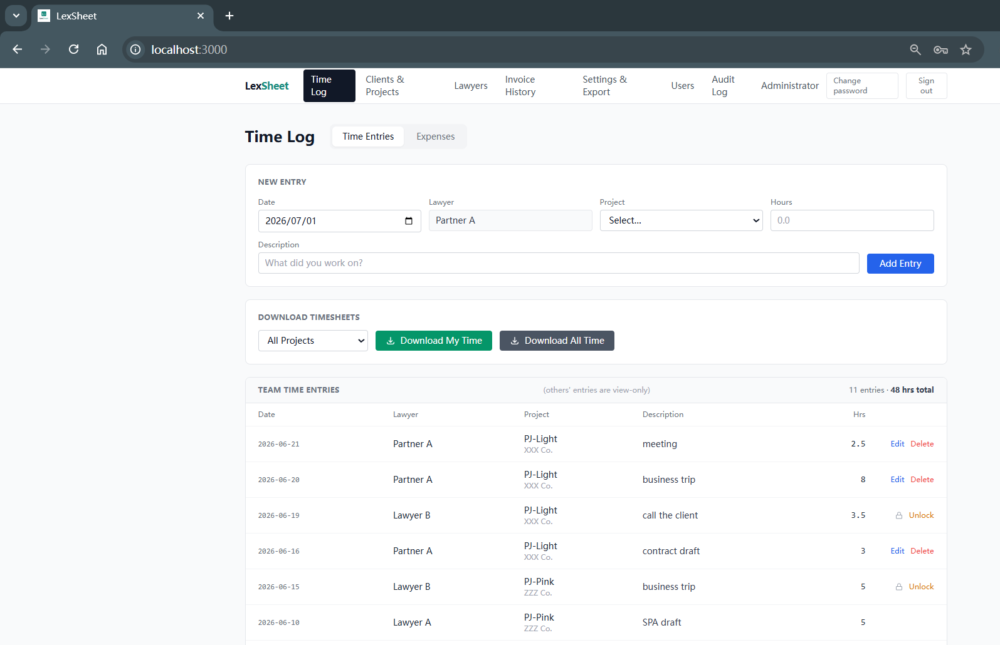
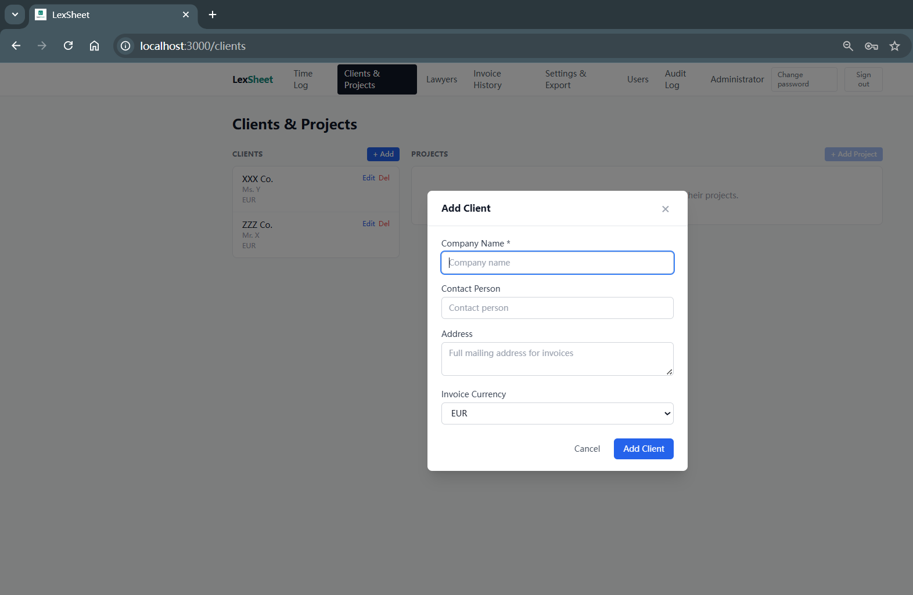
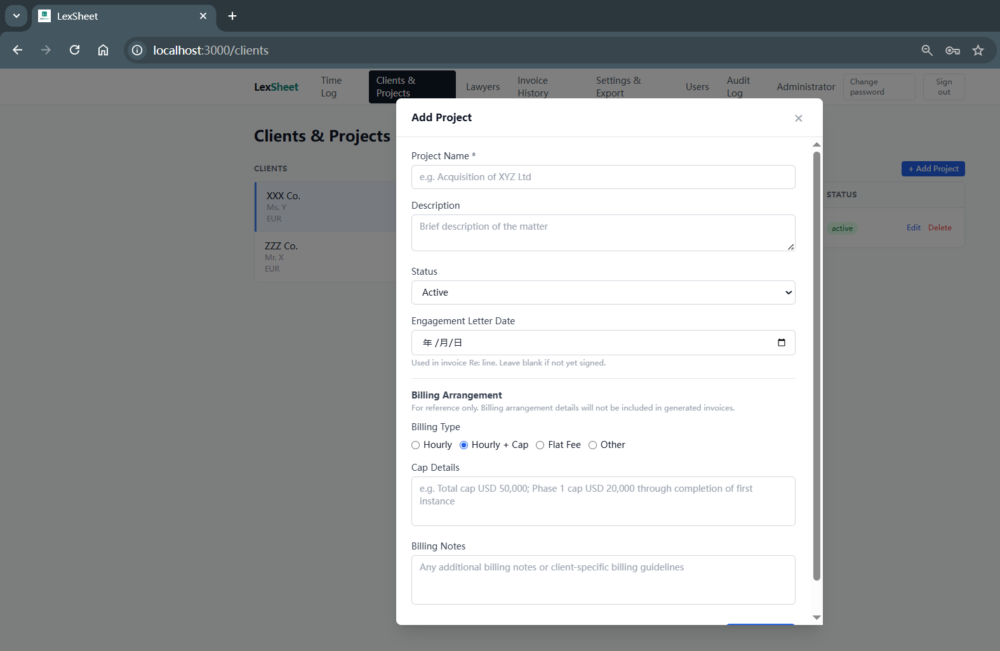
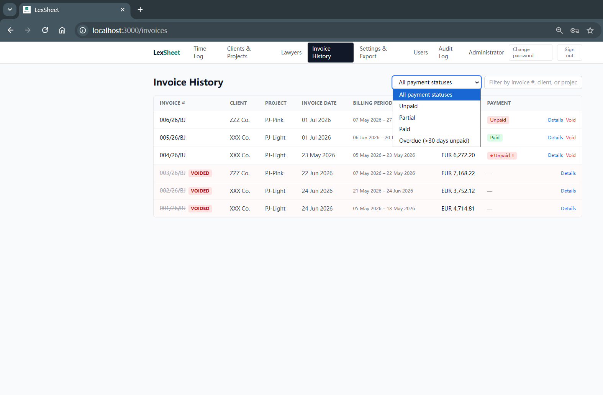
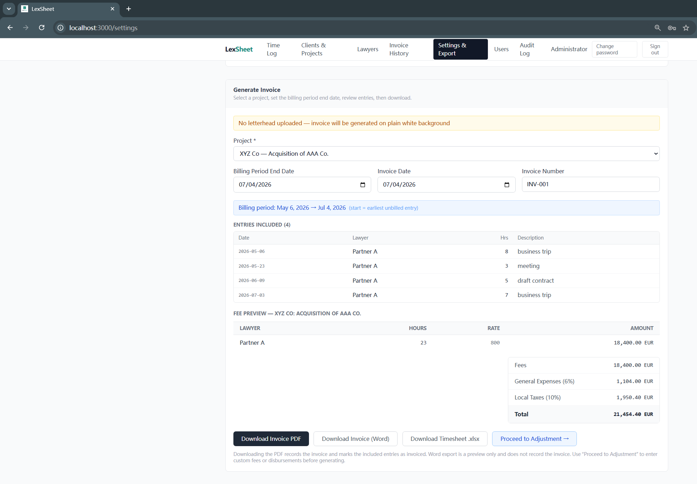
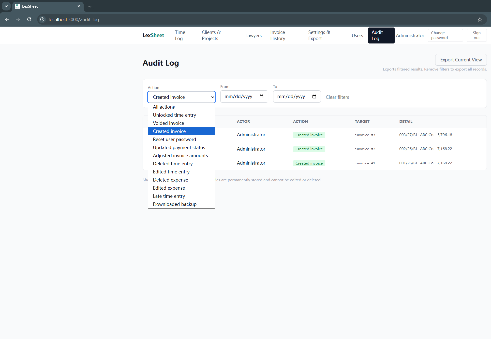

# LexSheet — Legal Billing & Time Tracking for Small Law Firms

A lightweight, self-hosted billing and time tracking tool designed around the practical needs of small legal teams.

Commercial legal billing software is often expensive and feature-bloated. LexSheet does one thing well: it helps small law firm teams log billable hours, track disbursements, and generate professional invoices — without a subscription fee or a cloud dependency.

> **Proprietary software, free to download and use** — no subscription, no activation code required. Subject to the [LICENSE (English)](./LICENSE.md) / [许可证（中文，以此为准）](./LICENSE-cn.md) terms. Contact [lexsheet@outlook.com](mailto:lexsheet@outlook.com) for support or feedback.

---

## Who is this for?

- Small law firms and solo practitioners (typically 3–5 fee earners)
- Teams that bill by the hour, with or without a fee cap
- Practices that need clean, professional invoices overlaid on firm letterhead
- Anyone who wants their client data to stay on their own machine

---

## Key Features

**Time & expense tracking**
- Daily time entry logging per lawyer, per matter
- Expense / disbursement recording with multi-currency support
- Automatic 10-day lock on time entries to prevent backdating through the application interface; audit trail of all edits and deletions

**Invoice generation**
- Partner-reviewed adjustment step before finalisation: manually set Fees and Disbursements amounts
- PDF output overlaid on your firm's letterhead
- Word (.docx) output for manual formatting
- Auto-generated Re: line referencing matter description, billing period, and engagement letter date

**Billing administration**
- Per-matter billing arrangement notes (Hourly / Hourly with Cap / Flat Fee / Other)
- Invoice history with payment status tracking (Unpaid / Partial / Paid)
- Overdue flagging for invoices unpaid 30 days after the invoice date
- Invoice void and reissue with audit preservation

**Access & security**
- Role-based access: Admin (partner / management) and Normal (fee earner) roles
- All client data stored exclusively on your own device — the developer collects nothing
- Remote access via your preferred secure networking tool (e.g. Tailscale, ZeroTier)
- Audit log of all sensitive operations, exportable to Excel

**Deployment**
- Single Windows installer (.exe), no technical setup required
- Runs entirely offline after installation
- One-click backup from the Settings page

---

## Screenshots

**Time Log — daily entry and team overview**

**Clients & Projects — add client**

**Clients & Projects — add project with billing arrangement**

**Invoice History — payment status and overdue tracking**

**Settings & Export — invoice generation and fee preview**

**Audit Log — operation history with export**

---

## Download

👉 **[Download Latest Release](https://github.com/LexSheet/LexSheet-Release/releases/latest)**

> By downloading the Software, you agree to the terms of the [LICENSE (English)](./LICENSE.md) / [许可证（中文，以此为准）](./LICENSE-cn.md). The Chinese version prevails in case of inconsistency.

Current version: V1.0

**System requirements:** Windows 10 / 11 (64-bit). No additional software needed — the installer includes everything.

---

## Getting Started

1. Run the installer and select your install directory
2. Double-click `start.bat` to launch the server
3. Open your browser and go to `http://localhost:3000`
4. Log in with the default admin credentials (`admin` / `admin123`) and change your password when prompted
5. Go to Settings to enter your firm name, billing rates, and other details

> **Security note:** Change the default password before sharing the server address with team members or setting up remote access. Until changed, anyone who can reach the server address can log in with the default credentials.

For the full setup guide, see the [Installation & User Guide (中文 / English)](./installation-guide.md) included in the release package.

---

## Contact

For support, bug reports, or feature requests:

**[lexsheet@outlook.com](mailto:lexsheet@outlook.com)**

When reporting a bug, attaching a screenshot is helpful — please ensure any screenshot is redacted of client-identifying information before sending.

---

## Remote Access

LexSheet runs on a local server within your office network. For access outside the office, you will need a secure networking tool such as [Tailscale](https://tailscale.com) or [ZeroTier](https://www.zerotier.com).

**Note:** The choice of remote access tool and compliance with its terms of service is the user's sole responsibility. LexSheet has no affiliation with any third-party networking tools and accepts no liability in connection with their use. In particular, Tailscale's free Personal plan is intended for non-commercial use; users should review the applicable terms before use.

---

## Data & Privacy

All data entered into or generated by the Software — including client information, time records, expense records, and invoices — is stored exclusively on your own device or local network. The Software does not collect, transmit, or send any data to the developer or to any third party. See the LICENSE for full data and privacy terms, including the handling of information voluntarily submitted via the support email.

---

## Technical Notes

- Built with Next.js 15, TypeScript, SQLite (via Node.js built-in `node:sqlite`), Tailwind CSS
- Implementation with AI-assisted development
- Proprietary software distributed as a self-contained Windows installer built with Inno Setup 6, bundled with portable Node.js 22
- Open-source dependencies are predominantly licensed under MIT and other permissive licences; see THIRD-PARTY-LICENSES.txt for the complete list and per-package terms.

---

## License

LexSheet is proprietary software, currently free to download and use subject to the terms of the [LICENSE (English)](./LICENSE.md) / [许可证（中文，以此为准）](./LICENSE-cn.md). The Chinese version prevails in case of inconsistency. See LICENSE for full terms including disclaimer of warranties and limitation of liability.

Open-source components used in this project remain subject to their respective licenses; see THIRD-PARTY-LICENSES.txt for details.

---

